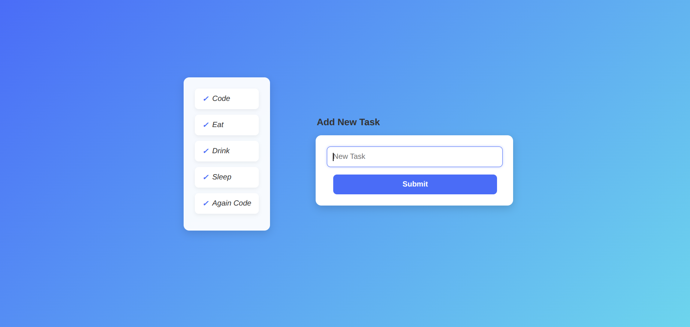

# 📝 **Simple Task List App**

A clean, responsive **To-Do list web app** built with **HTML**, **CSS**, and **JavaScript**.  
It allows users to add tasks dynamically and provides a visually appealing UI.

---

## 📌 **Features**
- Add new tasks via an input form.
- Prevents adding empty tasks (submit button is disabled until text is entered).
- Tasks are displayed with a **checkmark icon** and hover effects.
- Modern **UI/UX** with a gradient background and card-style design.
- Responsive layout that works on desktop and mobile.

---

## 📂 **Project Structure**


├── **index.html** # Main HTML file containing the task list container and form

├── **style.css** # CSS styling for the UI and task list

├── **script.js** # JavaScript logic for adding and displaying tasks

└── **README.md** # Project documentation


---

## 🛠 **Technologies Used**
- **HTML5** – for structuring the app
- **CSS3** – for styling and responsive layout
- **Vanilla JavaScript** – for interactivity

---

## 🚀 **How to Run**
1. **Clone the repository**
   ```bash
   git clone https://github.com/itxMUmerFarooqBajwa321/to_do_javascript.git

---

## 🎯 **Usage**

1. Enter a task in the **"New Task"** input field.

2. The **Add Task button** will become **active** once text is entered.

3. **Click** Add Task to add it to the **Task List**.

4. Tasks will appear in a **Card-Like List** with a **checkmark**.

---

## 📷 **Screenshot**



---

## 📄 **License**

This project is **licensed** under the **MIT License** – you can freely use and modify it.

---

## 💡 Future Improvements

- Add **delete** button for each task.

- Allow **marking** tasks as completed.

- Store tasks in **local storage** so they persist after page reload.

- Add drag-and-drop **task reordering**.

---

